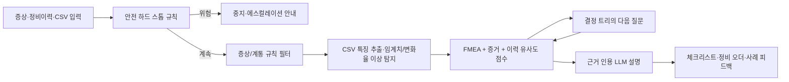
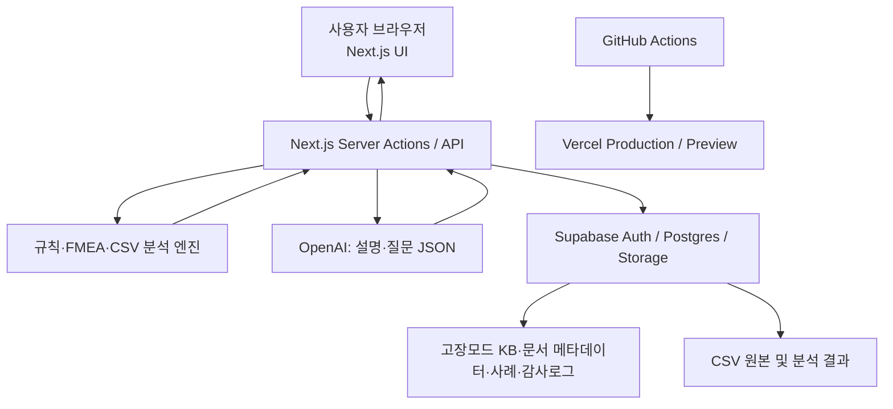

# VoltGuard — 전기차 AI 설비 정비 도우미

> **한 줄 제안**: 비숙련자도 증상 입력과 센서 CSV 분석만으로 `지금 멈춰야 하는지`, `무엇을 어떤 순서로 확인할지`, `어떤 근거로 정비사에게 넘길지`를 판단하게 하는 **근거 제시형 EV 초기 진단 웹**

## 0. 경연대회 승리 전략

단순한 ‘고장 원인 챗봇’은 흔합니다. VoltGuard는 아래 네 가지를 한 화면의 흐름으로 연결해 차별화합니다.

1. **안전 우선 게이트** — 고전압·화재·누유·충돌 징후는 AI 추론 전에 즉시 사용 중지/전문가 호출로 분기한다.
2. **설명 가능한 하이브리드 진단** — 규칙·FMEA·시계열 분석은 코드가 계산하고, LLM은 근거를 벗어나지 않는 쉬운 설명과 후속 질문만 담당한다.
3. **실제 공개 실험 데이터 시연** — NASA/DOE의 전압·전류·온도·용량 데이터를 분석하여 ‘채팅만 하는 서비스’가 아니라는 것을 보여 준다.
4. **조치가 끝까지 이어지는 제품** — 진단 결과 → 체크리스트 → 정비 오더(PDF/인쇄) → 정비 결과 피드백 → 유사 사례 검색의 폐루프를 만든다.

이 기획의 권장 범위는 **MVP: 구동 배터리와 열관리계통**, **확장: 구동모터·감속기·하체의 소음/진동**이다. 전기차의 고전압 배터리는 온도·전압·전류·SOC/SOH처럼 수치화된 신호가 풍부하고, 무료 공개 실험 데이터도 있어 짧은 해커톤에서 가장 설득력 있게 완성할 수 있다. 단, 이 서비스는 정비 지시나 안전 인증 도구가 아니며, 고전압 부품을 사용자가 분해·접촉하게 안내하지 않는다.

---

## 1. 원문 요구사항 반영 매트릭스

| 공유 자료의 항목 | VoltGuard 구현 방식 |
| --- | --- |
| 설비 점검 로그/소음·진동·온도 상승 등 증상 입력 | 설비(차량)·계통·증상·발생 시점·운전 조건·최근 정비 이력의 구조화 폼 + 자유 텍스트/사진 메모 |
| 증상 기반 원인 후보 추론·우선순위화 | 규칙 필터로 후보를 먼저 제한하고, FMEA 위험점수와 센서 이상점수 및 이력 유사도를 합산하여 순위화 |
| 예상 원인 순위·점검 체크리스트·조치/에스컬레이션 | ‘진단 브리핑’ 카드, 안전 순서 체크리스트, 자가 가능/정비소/긴급 세 단계 행동 가이드 제공 |
| 진단 챗봇 및 추가 질문 진단 트리 | 코드 기반 결정 트리가 가장 정보량 큰 질문 1개를 제시하고, 답에 따라 후보·점수를 실시간 갱신 |
| 발생 확률·긴급도 표시 | ‘확률’이라는 과장 대신 초기에는 **정합도(증상과의 일치도)** 와 **긴급도** 를 분리 표시; 충분한 검증 데이터 축적 후 보정 확률로 전환 |
| FMEA | Severity(S) × Occurrence(O) × Detection(D)의 RPN 및 안전 하드 스톱을 결합한 설명 가능한 우선순위 |
| 유사 과거 정비 사례 | 증상 태그·센서 특징·차량 계통으로 사례를 검색하고 ‘조치 후 해결됨’ 결과를 보여 줌 |
| 온도/진동 CSV 업로드 | 드래그앤드롭 → 컬럼 매핑 → 임계치/변화율/이상치 분석 → 차트·이벤트 타임라인 생성 |
| 정비 오더 자동 변환 | 진단 결과를 승인 가능한 작업지시서(점검항목·위험도·필요 공구·사진·판정)로 생성·인쇄 |
| 지식베이스 표·규칙+LLM·코드 진단 트리 | Supabase 테이블 중심 KB, TypeScript 규칙 엔진, LLM은 근거 인용·설명·대화만 담당 |
| 샘플 정비 이력으로 검증 | NASA/DOE 실험 데이터 + 팀 제작 시나리오 8건으로 회귀 테스트·데모 모드 구성 |

---

## 2. 사용자와 대표 데모 시나리오

### 2.1 핵심 사용자

- **초기 대응자(운전자/현장 운영자)**: 경고등, 충전 중 과열, 평소와 다른 진동을 빠르게 분류한다.
- **정비 접수 담당자**: 고객의 표현을 구조화된 정비 오더로 바꿔 정비사에게 전달한다.
- **숙련 정비사/관리자**: AI의 근거, 센서 그래프, 과거 사례를 검토하고 최종 판정·피드백을 남긴다.

### 2.2 발표용 황금 시나리오 (3분)

1. 로그인한 사용자가 ‘IONIQ 5 호환 데모 차량 / 배터리·열관리’를 고르고 `급속충전 18분 후 충전 제한 경고, 배터리 온도 상승, 냉각계통 정비 없음`을 입력한다.
2. 안전 게이트가 ‘연기·타는 냄새·충돌·누액이 있습니까?’를 먼저 묻는다. **없음**을 선택한다.
3. 진단 트리가 ‘냉각수 경고/펌프 소리/외기온/충전 중단 여부’를 하나씩 묻고, 후보를 `냉각수 부족·누설`, `냉각수 펌프/밸브 이상`, `열관리 제어 이상`, `배터리 셀 불균형` 순으로 좁힌다.
4. NASA 또는 DOE CSV를 업로드한다. 온도 상승률·전압 편차·전류 구간을 자동 탐지하고, 차트에 ‘주의 이벤트’가 표시된다.
5. 결과 화면의 FMEA 레이더/위험도와 ‘확인 순서’를 보여 주고, ‘정비 오더 생성’을 누른다.
6. 정비사가 결과를 `펌프 커넥터 접촉 불량 / 수리 완료`로 확정하면 사례가 축적되고, 다음 유사 진단의 근거가 된다.

### 2.3 반드시 포함할 안전 데모 분기

`연기·타는 냄새·고전압 배터리 손상 의심·충돌 후 누액·침수` 중 하나라도 선택하면 일반 점검을 중단하고 **운행/충전 중지, 탑승자 이격, 제조사·긴급 서비스 연락**을 최상단에 표시한다. 이때 ‘자가 조치’ 버튼은 숨긴다. 고전압 시스템의 분해, 절연 시험, 서비스 플러그 조작은 자격 있는 정비사 전용으로 분리한다.

---

## 3. 제품 화면과 시각화 설계

### 3.1 화면 구성

| 화면 | 핵심 구성 | 심사위원에게 보이는 가치 |
| --- | --- | --- |
| 랜딩/로그인 | 문제 상황, 3단계 작동 방식, 데모 시작, Supabase 이메일·OAuth 로그인 | 실제 서비스 같은 신뢰감 |
| 대시보드 | 진행 중 진단, 최근 정비 오더, 차량별 위험 상태, 새 진단 버튼 | ‘챗봇’이 아닌 업무 제품 |
| 새 진단 | 설비·계통 선택, 증상 칩, 발생 시점, 운전조건, 이력, 안전 게이트 | 비숙련자도 입력 가능 |
| 대화형 진단 | 한 번에 한 질문, 답변 이유, 후보 변화 애니메이션, 근거 링크 | 추론 과정의 투명성 |
| CSV 분석실 | 업로드, 컬럼 매핑, 데이터 품질 확인, 차트, 이상 이벤트 표 | 실제 데이터 분석 역량 |
| 진단 브리핑 | 원인 Top 3, 정합도/긴급도/FMEA, 체크리스트, ‘하지 말 것’, 에스컬레이션 | 즉시 행동 가능한 결과 |
| 사례/오더 | 유사 사례, 조치 결과, 승인·완료 상태, PDF/인쇄 | 지식 축적과 운영 완결성 |
| 관리자 KB | 증상-고장모드-근거-임계값-질문 편집, 버전 이력 | LLM 환각을 제어하는 구조 |

### 3.2 시각화 우선순위

1. **위험 신호 타임라인**: 시간축에 온도·전압·전류와 경고 이벤트를 겹친다. ‘언제부터’ 이상이 시작됐는지 즉시 보인다.
2. **배터리 상태 카드**: 최고 온도, 온도 상승률(°C/min), 전압 최소/최대/편차, 전류 피크, 추정 SOC/SOH를 신호등 색으로 표현한다.
3. **원인-증거 매트릭스**: 행=원인 후보, 열=입력 증거. 일치=파랑, 모순=회색, 미확인=점선으로 표현한다.
4. **FMEA 레이더/막대**: 심각도·발생성·검출난이도와 RPN을 병기한다. 점수만으로 안전성을 판단하지 않도록 하드 스톱 표식을 함께 둔다.
5. **진동 확장 뷰**: 가속도 CSV가 들어오면 RMS, peak-to-peak, crest factor와 FFT 주파수 스펙트럼을 표시해 불평형/베어링 계열 의심을 보조한다.

Stitch에서는 ‘어두운 정비소 제어실’이 아니라 **밝은 안전 대시보드**(중립 배경, 청록=정상, 호박=주의, 적색=즉시 중지, 색만으로 상태를 구분하지 않는 아이콘/텍스트)를 디자인한다. 모바일에서도 안전 게이트와 체크리스트가 먼저 보이도록 한다.

---

## 4. 진단 엔진: 코드가 판단하고 AI가 설명하는 구조

### 4.1 전체 흐름



### 4.2 후보 선정과 점수 공식

**1단계 — 규칙 필터 (결정적 코드)**

- 계통이 `battery_thermal`이면 배터리·냉각·BMS·충전 계통 고장모드만 남긴다.
- `충전 중 과열` + `온도 상승률 초과`이면 열관리 후보를 가점한다.
- `주행 중 특정 속도에서만 진동`이면 배터리 후보를 감점하고 구동모터/휠·하체 후보로 보낸다.
- 위험 키워드/선택값은 점수와 무관하게 하드 스톱한다.

**2단계 — 우선순위 점수 (설명 가능한 코드)**

```text
RPN = Severity(1~10) × Occurrence(1~10) × DetectionDifficulty(1~10)
priority = 0.35×FMEA_norm + 0.30×symptom_match
         + 0.20×sensor_anomaly + 0.15×case_similarity

단, 안전 하드 스톱 또는 Severity ≥ 9 이면 priority와 무관하게 “즉시 에스컬레이션”
```

- `symptom_match`: 증상·발생시점·운전 조건이 해당 고장모드의 KB 규칙과 맞는 비율
- `sensor_anomaly`: 임계치 초과, 변화율, 이동평균 이탈, 셀/측정치 편차를 0~1로 정규화한 값
- `case_similarity`: 증상 태그와 수치 특징의 cosine/pgvector 유사도. **확정 완료 사례만** 가중한다.
- 최초 공개 버전의 ‘정합도’는 위 점수를 사람 친화적으로 바꾼 등급이며 통계적 고장 확률이 아니다. 라벨 데이터가 충분하면 isotonic calibration 등으로 검증 후 확률로 승격한다.

**3단계 — 정보 이득 질문 (결정 트리 코드)**

현재 Top 2 후보의 점수 차이를 가장 크게 벌릴 수 있는 질문을 선택한다. 예: `충전 중에만 발생?`, `경고등/진단코드 있음?`, `냉각수 수위 경고?`, `외기온?`, `충돌·침수 이력?`. LLM은 질문을 다정하고 쉬운 한국어로 바꾸되, 질문의 선택지와 분기 결과를 바꾸지 못한다.

### 4.3 LLM 책임 경계와 프롬프트 가드레일

| 영역 | 담당 | 금지/검증 |
| --- | --- | --- |
| 임계값 비교, CSV 통계·FFT, FMEA, 후보 순위, 안전 분기 | TypeScript 서버 코드 | 모델이 수치·순위를 임의 수정하지 못함 |
| 원인 설명, 체크리스트 문장화, 추가 질문의 쉬운 표현 | LLM | KB 근거 ID가 없는 단정 금지 |
| 제조사/공식 문서 안내 | 검색된 문서 메타데이터·링크 | 문서 원문을 무단 복제하지 않고 제목·링크·적용 차량 표시 |
| 최종 고장 확정과 고전압 작업 | 정비사 | 사용자에게 ‘확정 진단’처럼 보이지 않게 UI 표기 |

LLM 응답은 Zod 스키마(JSON)로 강제한다. 서버는 `allowedCauseIds`, `evidenceIds`, `safetyLevel`을 검증하고 실패 시 템플릿 기반 결과로 안전하게 폴백한다. 모든 결과에 `진단 KB 버전`, `근거 문서`, `데이터 한계`를 표시한다.

---

## 5. MVP 지식베이스 예시

| 고장모드 | 대표 증상/증거 | FMEA 예시(S/O/D) | 1차 비침습 확인 | 조치 경계 |
| --- | --- | ---: | --- | --- |
| 냉각수 부족·외부 누설 | 충전/고부하 뒤 온도 상승, 냉각수 경고, 누적 온도 상승 | 8/4/4 | 안전한 냉간 상태에서 경고·바닥 누액·외관만 확인 | 누액/경고 지속 시 정비소 |
| 냉각 펌프·밸브 이상 | 냉각 온도 차 비정상, 반복 과열, 순환음 이상 | 8/3/6 | 경고등/진단코드/온도 추세 확인 | 고전압 계통 포함 정비사 호출 |
| BMS 센서/통신 이상 | 온도·전압 값 급변/결측, 셀 편차, 경고코드 | 8/3/7 | CSV 결측·센서 불일치·경고코드 확인 | 자가 수리 금지, 전문 진단 |
| 셀 불균형/열화 | 전압 편차 증가, 용량/SOH 하락, 충전 제한 | 9/3/8 | 충전 패턴·경고코드·트렌드 확인 | 운행/충전 제한 및 제조사 점검 |
| 충전 커넥터/충전기 접점 과열 | 충전 중 국소 발열, 충전 중단, 커넥터 이상 | 9/3/5 | 충전 중단 후 외관/냄새/변색만 확인 | 화상·연기·냄새면 즉시 이격/긴급 대응 |
| 구동모터/감속기 이상(확장) | 가속/감속 시만 소음·진동, 특정 RPM 대역 피크 | 7/4/6 | 발생 조건 기록, 진동 FFT 확인 | 분해 점검은 정비사 |
| 휠/타이어/하체(확장) | 속도 의존 진동, 편마모·공기압 경고 | 6/5/3 | 타이어 외관·공기압 경고 확인 | 주행 안전 저하면 즉시 정비 |

> 위 점수와 임계값은 **데모용 초기 KB**다. 특정 차종의 정비 기준값이 아니며, 실제 서비스에서는 차종/연식/제조사 문서와 정비사 검토를 거쳐 버전 관리한다.

---

## 6. 데이터 확보·활용 계획

### 6.1 우선 사용할 공개 공식 측정 데이터

| 우선순위 | 데이터 | 확보처·라이선스/공개성 | 실제 컬럼·용도 | 기획상 활용 |
| --- | --- | --- | --- | --- |
| 1 | **INL 2017 Nissan Leaf 셀 시험** | [DOE Vehicle Technologies Office Battery Hub](https://batterydata.energy.gov/dataset/inl-nissan-leaf-cell-testing) — 계정 없이 공개 | 여러 온도, 동적 주행 사이클 방전, DC 급속/AC-L2 충전의 raw/summary CSV | EV 맥락이 가장 직접적. 업로드·온도/전류/전압 시각화와 충전 조건별 비교 데모 |
| 2 | **NASA Li-ion Battery Aging** | [NASA PCoE 데이터 저장소](https://www.nasa.gov/intelligent-systems-division/discovery-and-systems-health/pcoe/pcoe-data-set-repository/)의 `5. Battery Data Set` (공개 ZIP 약 200MB) | 10Hz 수준 전압·전류·온도·용량·임피던스, 온도/부하별 충방전·열화 | CSV 변환 스크립트로 `battery_id, timestamp_s, voltage_v, current_a, temperature_c, capacity_ah` 표준 스키마 생성; SOH·열화 추세 시연 |
| 3 | **NASA Randomized Battery Usage** | [NASA PCoE 11번 공개 데이터](https://www.nasa.gov/intelligent-systems-division/discovery-and-systems-health/pcoe/pcoe-data-set-repository/) | 무작위 부하, 기준 충방전, 온도 조건별 운용 데이터 | 불규칙 운전 조건에서의 이상 탐지/잔여수명(RUL) 확장 데모 |
| 보조 | **EPA 48V MHEV HIL 검증 데이터** | [미 EPA 공개 지원 데이터](https://catalog.data.gov/dataset/supporting-data-for-lee-s-d-cherry-j-safoutin-m-mcdonald-j-et-al-2018-modeling-and-validat) | 규제 주행 사이클 기반 전압·전류·SOC, HIL 검증 | SOC 추세 시각화의 추가 근거. BEV와 동일시하지 않고 48V MHEV로 명시 |

### 6.2 데이터 내려받기·정규화 작업

저장소에는 원본 대용량 파일을 Git에 올리지 않는다. `data/README.md`에 원본 URL·다운로드 날짜·라이선스·SHA-256·변환 규칙을 기록하고 `.gitignore`에 `data/raw/`를 넣는다.

```text
data/
  README.md                  # 출처·라이선스·재현 절차
  raw/                       # Git 제외: 원본 ZIP/CSV
  processed/                 # Git 제외: 표준화 parquet/csv
  demo/                      # Git 포함: 출처·변환 설명이 있는 작은 익명 데모 CSV
scripts/
  download-public-data.ts    # 원본 URL에서 내려받기
  normalize-nasa-battery.ts  # MAT → 표준 시계열 CSV/Parquet
  validate-sensor-csv.ts     # 업로드 데이터 검증
```

**표준 업로드 계약**: `timestamp`, `temperature_c` 중 하나 이상은 필수. 배터리 분석은 `voltage_v`, `current_a`, `soc_pct`, `cell_voltage_*`를 선택적으로 받는다. 진동 분석은 `accel_x_g`, `accel_y_g`, `accel_z_g`, `sample_rate_hz`를 받는다. 열 이름이 달라도 UI에서 한 번 매핑하고 그 매핑을 저장한다.

**전처리와 품질 표시**: 단위 변환, timestamp 정렬, 중복 제거, 결측 비율, 샘플링 간격, 허용 범위 검증을 코드로 수행한다. 품질이 낮으면 ‘신뢰도 낮음: 온도 값 38% 결측’처럼 결과 위에 노출하고, LLM에는 검증된 요약 특징만 전달한다.

### 6.3 제조사·점검사 공식 문서 지식화

- **제조사 예시**: [Hyundai 공식 Rescue Sheets 및 Emergency Response Guides](https://www.hyundai.com/eu/en/driving-hyundai/information/rescue-sheets.html)는 IONIQ·KONA 등 전기차의 차종별 구조/긴급 대응 자료를 제공한다. 차종을 선택했을 때 `차종 적용 문서` 링크로 표시한다.
- **점검/안전 기관 허브**: [NHTSA Emergency Response Guides](https://www.nhtsa.gov/emergency-response-guides)는 제조사가 제출한 BEV/HEV/PHEV/FCEV별 구조·화재·침수·누액·견인/보관 대응 자료를 한곳에서 찾게 한다.
- **일반 안전 경계**: [NHTSA EV 배터리·충전·안전 안내](https://www.nhtsa.gov/vehicle-safety/electric-and-hybrid-vehicles)는 고전압 계통은 EV 교육을 받은 정비사가 다뤄야 함을 명시한다.

문서는 `제목 / 발행기관 / URL / 대상 차종·연식 / 적용 계통 / 안전등급 / 발행·검토일 / 추출 요약 / 사용 허가 메모`만 KB에 저장하고, 원문 PDF는 복제·재배포하지 않는다. 긴급 대응 자료는 일반 정비 매뉴얼을 대체하지 않으므로 ‘점검사 전용’ 영역에는 공식 서비스 매뉴얼의 구독/승인 필요 상태를 명확히 표시한다.

---

## 7. 기술 아키텍처와 데이터 모델

### 7.1 권장 스택

| 층 | 선택 | 이유 |
| --- | --- | --- |
| 웹 | Next.js (App Router) + TypeScript + Tailwind CSS + shadcn/ui | Codex로 빠르게 구현·Vercel 배포가 간단하고 타입 안전 |
| 그래프 | Recharts (시계열/막대) + 가벼운 SVG 레이더, FFT는 서버 계산 | CSV 분석 시연에 충분하고 의존성 부담이 작음 |
| AI | OpenAI Responses API + structured output(Zod) | 진단 설명·후속 질문·오더 문장화, 엄격한 JSON 검증 |
| 진단 코드 | 순수 TypeScript rules engine + zod + simple-statistics/FFT 라이브러리 | 재현 가능하고 테스트 가능하며 환각 방지 |
| 인증/DB/파일 | Supabase Auth + Postgres + Storage + pgvector | 이메일/OAuth 로그인, RLS, 사례 검색, CSV 보관을 한 번에 |
| 배포/CI | GitHub + Vercel + GitHub Actions | PR 미리보기와 자동 테스트, 발표 URL 제공 |
| 관찰성 | Vercel 로그 + `diagnosis_audits` 테이블 | 결과·근거·KB 버전·모델 호출을 추적 |

### 7.2 논리 아키텍처



### 7.3 Supabase 핵심 테이블

| 테이블 | 핵심 필드 | RLS 원칙 |
| --- | --- | --- |
| `profiles` | `id`, `role`, `display_name` | 본인 조회/수정, 관리자 역할 별도 |
| `vehicles` | `id`, `owner_id`, `make`, `model`, `year`, `powertrain` | 소유자/소속 팀만 접근 |
| `diagnoses` | `id`, `vehicle_id`, `symptom_json`, `safety_level`, `kb_version`, `status` | 생성자와 담당 정비사만 |
| `diagnosis_candidates` | `diagnosis_id`, `failure_mode_id`, `score`, `evidence_json`, `fmea_snapshot` | 상위 진단 권한 상속 |
| `sensor_uploads` | `diagnosis_id`, `storage_path`, `schema_map`, `quality_report` | private bucket + 서명 URL |
| `sensor_features` | `upload_id`, `metric`, `value`, `unit`, `event_at` | 상위 업로드 권한 상속 |
| `failure_modes` | `id`, `system`, `symptom_rules`, `fmea`, `checklist_json` | 읽기는 인증 사용자, 편집은 관리자 |
| `knowledge_sources` | `title`, `publisher`, `url`, `applicability`, `reviewed_at` | 읽기 전용, 관리자 편집 |
| `maintenance_cases` | `diagnosis_id`, `confirmed_mode`, `action`, `outcome`, `embedding` | 개인/조직 범위, 확정 사례만 검색 |
| `work_orders` | `diagnosis_id`, `status`, `approved_by`, `snapshot_json` | 작성자/담당자/관리자만 |
| `diagnosis_audits` | `diagnosis_id`, `engine_version`, `prompt_version`, `evidence_ids` | 관리자 감사용 |

`work_orders.snapshot_json`은 당시 후보·점수·근거·체크리스트를 고정해, 나중에 KB가 바뀌어도 과거 작업지시서가 변하지 않게 한다. 사용자별 데이터는 모든 테이블에서 `auth.uid()` 기반 RLS로 제한한다. 서비스 키는 브라우저에 절대 노출하지 않는다.

---

## 8. 핵심 기능 상세 명세

### 8.1 구조화된 진단 챗봇

- 첫 화면에서 사용자의 자연어를 받아 `증상, 계통, 발생 시점, 주행/충전 조건, 경고등, 최근 정비` 초안으로 파싱한 뒤 **사용자 확인**을 받는다.
- 안전 게이트 → 규칙 후보 → 다음 질문 → 결과의 순서로 진행한다. 자유로운 잡담형 대화가 아니라 체크 가능한 진단 흐름이다.
- 각 원인 후보에는 `왜 이 후보인가`, `어떤 관측값이 부족한가`, `다음 확인이 후보 순위를 어떻게 바꾸는가`를 보여 준다.
- 결과에는 반드시 `자가 확인 가능(비침습)`, `운행/충전 제한`, `전문가 호출` 중 하나를 명시한다.

### 8.2 CSV 자동 분석

1. MIME/크기/행 수를 검사하고, 악성 수식·너무 큰 파일을 차단한다.
2. 사용자가 열을 표준 스키마에 매핑한다. 샘플 20행을 미리 보인다.
3. 서버에서 이동평균, 기울기, z-score/IQR 이상치, 온도 상승률, 최대·최소·편차를 계산한다.
4. 진동 데이터이면 RMS·crest factor·dominant frequency를 계산하고, 해석은 ‘의심 신호’로 한정한다.
5. 이벤트/특징만 진단 엔진과 LLM에 전달하고 원본 데이터는 private Storage에 보관한다.

### 8.3 유사 사례와 학습 루프

- 처음에는 팀이 만든 **명시적 합성 사례** 8개를 넣는다. 각 사례는 ‘합성/데모’ 배지를 표시한다.
- 정비사가 `미확정/확정/오진`과 조치 결과를 입력한다. 확정·해결 사례만 다음 검색의 강한 근거로 쓴다.
- 매주 `후보 Top-3 포함률`, `에스컬레이션 누락률(0 목표)`, `CSV 오류 처리율`, `정비사 승인률`을 점검한다.

### 8.4 정비 오더

자동 생성 내용: 접수번호, 차량/계통, 증상 요약, 안전등급, Top 후보 및 근거, 센서 이상 이벤트, 점검 체크리스트, 필요 인력/보호구(일반 안내), 제조사 문서 링크, 최종 판정란, 사진 첨부란, 고객 안내 문구. AI 생성본은 **‘정비사 검토 필요’** 상태로만 저장하며, 승인 전에는 확정 진단서처럼 출력하지 않는다.

---

## 9. 구현 순서: Codex → Stitch → GitHub/Vercel → Supabase

### 9.1 0단계: 역할과 데모 범위 합의 (30분)

- 제품/발표: 시나리오, 데모 대본, 안전 문구 담당
- 프론트: Stitch 화면을 바탕으로 입력/대시보드/브리핑 구현
- 백엔드/AI: 규칙 엔진, OpenAI structured output, 정비 오더
- 데이터/DB: NASA·DOE 데이터 출처 문서화, CSV 정규화, Supabase 마이그레이션/RLS

팀 인원이 적다면 **안전 게이트 → 진단 결과 → CSV 차트 → 정비 오더** 순으로 먼저 완성한다. 사례 검색과 관리자 화면은 그다음이다.

### 9.2 1단계: Codex로 골격과 테스트 먼저 (60~90분)

```text
Codex 작업 프롬프트 예시

Next.js App Router + TypeScript 프로젝트에 VoltGuard를 구현해줘.
요구사항: (1) 전기차 배터리/열관리 증상 입력 폼,
(2) safetyGate.ts의 결정적 안전 분기,
(3) failureModes.ts의 FMEA 기반 후보 점수 계산,
(4) 진단 결과 Top 3와 체크리스트,
(5) fixture CSV를 읽어 temperature_c·voltage_v·current_a의 최대값/기울기/이상치를 반환,
(6) Vitest 단위테스트.
LLM 호출은 인터페이스만 만들고, UI에서 고전압 자가 수리 지침은 절대 출력하지 마.
```

생성 직후 Codex에게 `안전 분기가 모든 경로에서 결과보다 먼저 실행되는지`, `입력값 검증과 단위 테스트가 있는지`, `환경변수가 클라이언트 번들에 노출되지 않는지`를 코드 리뷰하게 한다.

### 9.3 2단계: Stitch로 화면 설계, Codex로 이식 (45분)

```text
Stitch 프롬프트 예시

Design a responsive Korean web dashboard named “VoltGuard”.
It is an AI EV maintenance triage tool, not a repair tutorial.
Create: dashboard, new diagnosis form, one-question-at-a-time diagnosis chat,
sensor CSV analytics, and diagnosis briefing. Use a calm light industrial design;
teal for normal, amber for caution, red for immediate stop. Make the immediate
safety banner visually dominant and accessible. Include a timeline chart,
cause-evidence matrix, Top 3 ranked causes, and checklist cards.
```

Stitch 산출물의 레이아웃/색/컴포넌트 구조를 확정한 뒤, 스크린샷과 요구사항을 Codex에 주고 Tailwind 컴포넌트로 구현한다. 디자인을 복사하는 것보다 ‘안전 배너가 항상 화면 상단에 고정’ 같은 UX 규칙을 코드로 보존하는 것이 중요하다.

### 9.4 3단계: Supabase 연결 (60분)

1. Supabase 프로젝트 생성, Email OTP 또는 Google OAuth 활성화
2. SQL migration으로 위 테이블과 RLS 정책 생성
3. private `sensor-uploads` 버킷 생성, signed URL 업로드 적용
4. `NEXT_PUBLIC_SUPABASE_URL`, `NEXT_PUBLIC_SUPABASE_ANON_KEY`, 서버 전용 AI 키를 Vercel 환경변수로 분리
5. 미로그인 사용자에게는 합성 사례 ‘데모 모드’만, 로그인 사용자에게만 저장 기능 제공

### 9.5 4단계: GitHub/Vercel 배포와 검증 (30~45분)

1. GitHub 저장소에 push하고 `main` 보호 규칙/PR 템플릿을 추가한다.
2. Vercel에 연결하여 PR Preview와 Production을 분리한다.
3. 환경변수는 Vercel 프로젝트 설정에만 넣고 `.env.local`은 커밋하지 않는다.
4. GitHub Actions에서 `lint → typecheck → test → build`를 실행한다.
5. 배포 URL에서 로그인, 위험 분기, 정상 분기, CSV 업로드, 오더 생성까지 5개 시나리오를 직접 점검한다.

---

## 10. 파일/모듈 설계와 수용 기준

```text
src/
  app/(app)/dashboard/page.tsx
  app/(app)/diagnose/new/page.tsx
  app/(app)/diagnose/[id]/page.tsx
  app/api/analyze-csv/route.ts
  app/api/diagnose/route.ts
  components/diagnosis/{SafetyGate,CauseRanking,EvidenceMatrix,Checklist}.tsx
  components/charts/{SignalTimeline,AnomalyMarkers,VibrationSpectrum}.tsx
  lib/diagnosis/{safetyGate,rules,scoring,nextQuestion,types}.ts
  lib/analytics/{schema,quality,features,thresholds}.ts
  lib/ai/{schema,prompt,explain}.ts
  lib/supabase/{client,server}.ts
supabase/migrations/
tests/{safetyGate,scoring,csvQuality,nextQuestion}.test.ts
data/demo/README.md
```

| 수용 기준 | 통과 조건 |
| --- | --- |
| 안전 | 연기/누액/침수/충돌/고전압 손상 의심 입력 시 어떤 경우에도 자가 수리 체크리스트가 나오지 않음 |
| 진단 | 배터리 열관리 시나리오에서 Top 3 후보·근거·다음 질문·체크리스트가 3초 내 표시됨(데모 데이터 기준) |
| 시각화 | CSV를 올리면 결측률과 최소 1개 이상의 차트, 임계치 또는 변화율 이벤트가 표시됨 |
| 설명 가능성 | 모든 후보에 evidence ID와 KB 버전이 저장되고 UI에서 ‘왜?’를 열 수 있음 |
| 데이터 | NASA/DOE 출처·다운로드 날짜·변환 규칙이 `data/README.md`에 기록됨 |
| 보안 | 로그인 사용자 간 진단/CSV/오더 접근이 RLS로 차단되며 비공개 버킷은 signed URL만 허용 |
| 품질 | 안전 게이트·FMEA·CSV 품질 검사 단위 테스트, 린트·타입체크·프로덕션 빌드 통과 |

---

## 11. 해커톤 시간표와 우선순위

| 순서 | 결과물 | 최소 성공선 | 시간 압박 시 제외할 것 |
| ---: | --- | --- | --- |
| P0 | 안전 게이트 + 구조화된 입력 | 위험 분기와 정상 입력 | 제외 불가 |
| P0 | 규칙/FMEA Top 3 + 체크리스트 | 6개 고장모드, 8개 질문 | 제외 불가 |
| P0 | 센서 CSV 차트 | 온도·전압·전류 1개 CSV | FFT·복잡 ML |
| P0 | 배포 가능한 웹 | 데모 모드, Vercel URL | 제외 불가 |
| P1 | Supabase 로그인/저장 | 이메일 로그인, 진단 저장 | OAuth, 조직 권한 |
| P1 | 정비 오더 | 화면 인쇄/PDF | 고급 결재 워크플로 |
| P2 | 사례 검색/pgvector | 합성 사례 카드 3개 | 자동 임베딩 파이프라인 |
| P2 | 관리자 KB | JSON/테이블 읽기 | UI 편집기 |

**권장 발표 문장**: “우리 서비스는 AI가 고장을 단정하지 않습니다. 위험 신호는 코드로 먼저 차단하고, 공개 실험 데이터에서 이상을 찾아, 근거와 함께 가장 안전한 다음 행동을 제시합니다. 정비 결과가 다시 사례가 되어 다음 진단을 더 나아지게 합니다.”

---

## 12. 리스크·윤리·한계 관리

- 공개 배터리 데이터는 실제 특정 차량 전체 팩의 현장 데이터가 아니다. 데이터 카드에 **셀/시험장비/실험 조건/전이 한계**를 명시한다.
- 원인 순위는 ‘가능성’이며 고장 확정이 아니다. 실제 차량의 DTC·제조사 서비스 매뉴얼·자격 정비사의 판단이 우선이다.
- 고전압·화재·침수·누유·충돌은 일반 사용자용 진단 범위를 벗어난다. 해당 데이터/키워드의 경우 상세 DIY 절차 대신 중지·이격·공식 연락 경로만 제공한다.
- 사용자 정비 로그·VIN·사진은 개인정보가 될 수 있다. 최소 수집, 보존 기간, 삭제 기능, RLS와 private Storage를 적용한다.
- AI가 생성한 문장은 KB 근거를 넘지 못하게 하고, 모델/프롬프트/KB 버전을 감사 로그에 남긴다.

---

## 13. 제출 전 체크리스트

- [ ] 실제 배포 URL에서 비로그인 데모가 열린다.
- [ ] NASA 또는 DOE 출처가 보이는 데모 CSV 1개가 정상 분석된다.
- [ ] ‘연기/누액’ 입력 시 즉시 중지 화면으로만 이동한다.
- [ ] 정상 시나리오에서 Top 3·근거·FMEA·체크리스트·오더가 한 번에 보인다.
- [ ] 모든 화면에 ‘AI 보조, 최종 정비 판단은 자격 정비사’ 문구가 있다.
- [ ] GitHub README에 실행법, 환경변수 이름(값 제외), 데이터 출처, 안전 한계, 데모 계정/방법을 적었다.
- [ ] 발표자는 ‘문제 → 안전 게이트 → CSV 시각화 → 근거 진단 → 정비 오더 → 사례 축적’ 순서로 끊김 없이 시연한다.

## 참고한 공식 자료

- NASA PCoE는 Li-ion 배터리의 온도별 충·방전·임피던스 실험 데이터와 Randomized Battery Usage 데이터를 공개한다: <https://www.nasa.gov/intelligent-systems-division/discovery-and-systems-health/pcoe/pcoe-data-set-repository/>
- NASA Open Data의 Li-ion Battery Aging 데이터 설명·필드: <https://data.nasa.gov/dataset/li-ion-battery-aging-datasets>
- DOE VTO Battery Hub의 INL Nissan Leaf 셀 시험 공개 데이터: <https://batterydata.energy.gov/dataset/inl-nissan-leaf-cell-testing>
- NHTSA의 제조사별 전동화 차량 Emergency Response Guide 허브: <https://www.nhtsa.gov/emergency-response-guides>
- Hyundai 공식 Rescue Sheet/Emergency Response Guide: <https://www.hyundai.com/eu/en/driving-hyundai/information/rescue-sheets.html>
- NHTSA EV 고전압·충전 안전 안내: <https://www.nhtsa.gov/vehicle-safety/electric-and-hybrid-vehicles>

